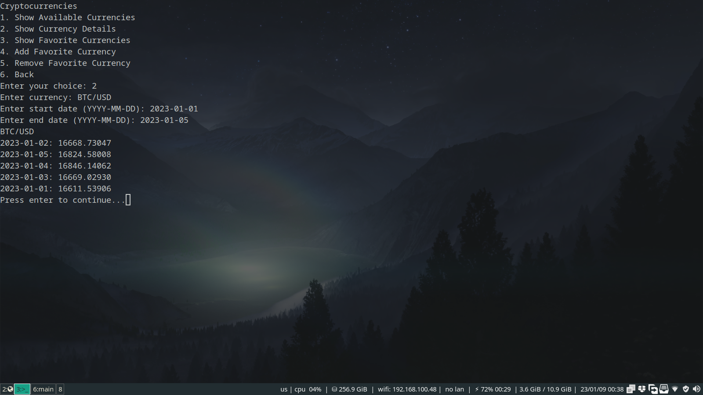
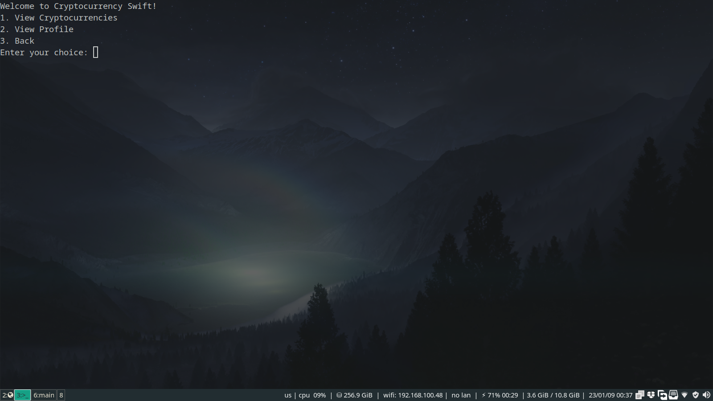
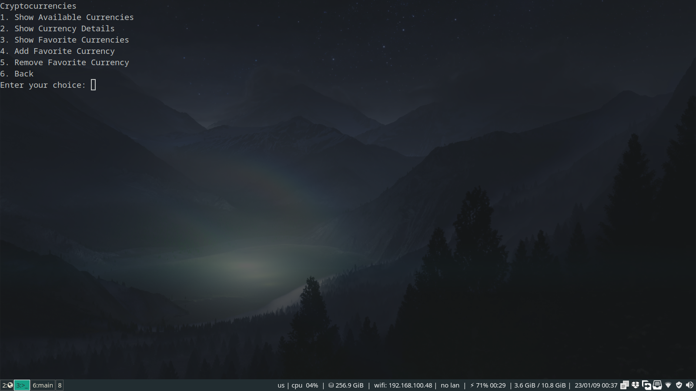

# mobile-swift-homework

**Mobile Programming Course Swift Homework**

**Parsa Mohammadian - 98102284**

**Sara Azarnoush - 98170668**

Fall 2022

## Introduction

This project is a simple command line application written in Swift that can be used to check the price of cryptocurrencies. It uses [Twelve Data API](https://twelvedata.com/) to fetch the data.

## Build and Run

You can build and run the project with Swift version 5.7.2 using below command:

```bash
$ swift run
```

In order to see debug information during the execution, you should pass proper arguments to Swift compiler as below:

```bash
$ swift run -Xswiftc -DDEV
```

## Technical Details

We have implemented the project using proper design patterns and principles in order to make it easily extensible to be used in SwiftUI application. All the classes are designed with MVC pattern in mind and to be independent of each other. 

## Screenshots
Although the project is a command line application, we have added some screenshots to show how it works.

<div align="center">
    
    
    
</div>